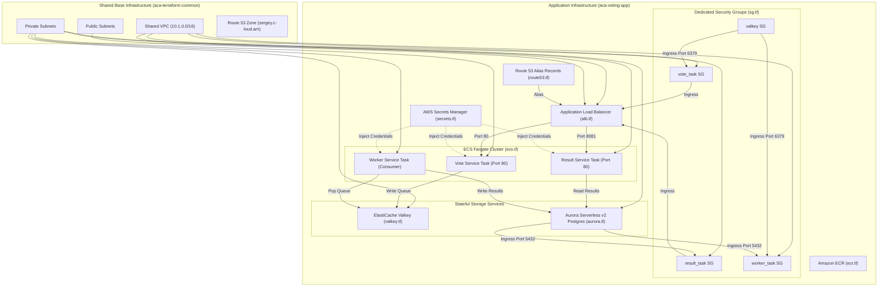

# ACA Voting App Terraform Infrastructure Documentation

This project provisions the complete cloud infrastructure to host the `vote`, `result`, and `worker` applications on AWS ECS Fargate, backed by **AWS ElastiCache Valkey** and **AWS Aurora Serverless v2 PostgreSQL**.

It reuses the shared network infrastructure exported by `../aca-terraform-common`.

---

## 📐 Architecture & Dependency Graph

---

## 📋 Requirements

| Name | Version |
|------|---------|
| **Terraform** | `>= 1.0.0` |
| **AWS Provider** | `~> 5.0` |
| **Random Provider** | `~> 3.0` |

---

## 📦 Terraform Community Modules

| Module Source | Name | Version | Purpose |
|---------------|------|---------|---------|
| `terraform-aws-modules/ecr/aws` | `ecr_vote`, `ecr_result`, `ecr_worker` | `~> 2.2` | Amazon ECR container image repositories |
| `terraform-aws-modules/alb/aws` | `alb` | `~> 9.0` | Application Load Balancer with target groups & listeners |
| `terraform-aws-modules/rds-aurora/aws` | `aurora` | `~> 9.0` | AWS Aurora Serverless v2 PostgreSQL cluster |
| `terraform-aws-modules/ecs/aws` | `ecs` | `~> 5.9` | AWS ECS Fargate cluster and task management |

---

## 📥 Inputs / Variables

| Name | Description | Type | Default | Required |
|------|-------------|------|---------|:--------:|
| `aws_region` | AWS region for deployment | `string` | `"eu-north-1"` | no |
| `app_name` | Application name identifier | `string` | `"aca-voting-app"` | no |
| `environment` | Deployment environment | `string` | `"production"` | no |
| `common_state_bucket` | S3 bucket storing `aca-terraform-common` state | `string` | `"tfstate-597936860210-eu-north-1-an"` | no |
| `common_state_key` | S3 key for `aca-terraform-common` state | `string` | `"aca-terraform-common/terraform.tfstate"` | no |
| `common_state_region` | AWS region of shared state bucket | `string` | `"eu-north-1"` | no |
| `domain_name` | Base Route 53 domain name | `string` | `"sergey.c-loud.am"` | no |
| `vote_subdomain` | Subdomain for vote web app | `string` | `"vote"` | no |
| `result_subdomain` | Subdomain for result web app | `string` | `"result"` | no |
| `vote_image_tag` | ECR Image tag for vote service | `string` | `"latest"` | no |
| `result_image_tag` | ECR Image tag for result service | `string` | `"latest"` | no |
| `worker_image_tag` | ECR Image tag for worker service | `string` | `"latest"` | no |
| `container_cpu` | Fargate Task CPU units | `number` | `256` | no |
| `container_memory` | Fargate Task memory (MB) | `number` | `512` | no |
| `aurora_min_capacity` | Aurora Serverless v2 Min ACU | `number` | `0.5` | no |
| `aurora_max_capacity` | Aurora Serverless v2 Max ACU | `number` | `1.0` | no |

---

## 📤 Outputs

| Name | Description |
|------|-------------|
| `shared_vpc_id` | Shared VPC ID imported from `aca-terraform-common` |
| `public_subnet_ids` | Public Subnet IDs used by the ALB |
| `private_subnet_ids` | Private Subnet IDs used by ECS Tasks, Aurora, and Valkey |
| `alb_dns_name` | Public Application Load Balancer DNS name |
| `vote_url` | Direct HTTP access URL for vote app (`http://<alb-dns>`) |
| `result_url` | Direct HTTP access URL for result app (`http://<alb-dns>:8081`) |
| `vote_domain_url` | Domain URL for vote app (`http://vote.sergey.c-loud.am`) |
| `result_domain_url` | Domain URL for result app (`http://result.sergey.c-loud.am`) |
| `aurora_cluster_endpoint` | PostgreSQL cluster writer endpoint |
| `elasticache_valkey_endpoint` | ElastiCache Valkey cluster endpoint |
| `secrets_manager_valkey_arn` | Secrets Manager ARN for Valkey password |
| `secrets_manager_postgres_arn` | Secrets Manager ARN for PostgreSQL user/password |
| `ecr_repository_vote_url` | ECR repository URL for vote image |
| `ecr_repository_result_url` | ECR repository URL for result image |
| `ecr_repository_worker_url` | ECR repository URL for worker image |
| `ecs_cluster_name` | Name of the ECS Cluster |
| `ecs_service_vote_name` | Name of the vote ECS Service |
| `ecs_service_result_name` | Name of the result ECS Service |
| `ecs_service_worker_name` | Name of the worker ECS Service |

---

## 🏗️ Resources Created

- **Application Load Balancer**: Multi-target group routing HTTP 80 & 8081.
- **Dedicated Security Groups**: `vote_task`, `result_task`, `worker_task`, `valkey`.
- **AWS Secrets Manager**: Storing auto-generated secure credentials.
- **AWS ElastiCache Valkey**: Multi-AZ capable single-node `cache.t4g.micro` with transit encryption.
- **AWS Aurora Serverless v2 PostgreSQL**: Auto-scaling database cluster (0.5 to 1.0 ACU).
- **Amazon ECS Cluster & Fargate Services**: `vote`, `result`, and `worker` tasks.
- **Route 53 A Alias Records**: Pointing `vote.sergey.c-loud.am` & `result.sergey.c-loud.am` to ALB.

<!-- BEGIN_TF_DOCS -->
## Requirements

| Name | Version |
| ---- | ------- |
|  [terraform](#requirement\_terraform) | >= 1.0.0 |
|  [aws](#requirement\_aws) | ~> 5.0 |
|  [random](#requirement\_random) | ~> 3.0 |

## Providers

| Name | Version |
| ---- | ------- |
|  [aws](#provider\_aws) | 5.100.0 |
|  [random](#provider\_random) | 3.9.1 |

## Modules

| Name | Source | Version |
| ---- | ------ | ------- |
|  [alb](#module\_alb) | terraform-aws-modules/alb/aws | ~> 9.0 |
|  [aurora](#module\_aurora) | terraform-aws-modules/rds-aurora/aws | ~> 9.0 |
|  [ecr\_result](#module\_ecr\_result) | terraform-aws-modules/ecr/aws | ~> 2.2 |
|  [ecr\_vote](#module\_ecr\_vote) | terraform-aws-modules/ecr/aws | ~> 2.2 |
|  [ecr\_worker](#module\_ecr\_worker) | terraform-aws-modules/ecr/aws | ~> 2.2 |
|  [ecs](#module\_ecs) | terraform-aws-modules/ecs/aws | ~> 5.9 |
|  [secrets\_manager\_postgres](#module\_secrets\_manager\_postgres) | terraform-aws-modules/secrets-manager/aws | ~> 1.1 |
|  [secrets\_manager\_valkey](#module\_secrets\_manager\_valkey) | terraform-aws-modules/secrets-manager/aws | ~> 1.1 |
|  [valkey](#module\_valkey) | terraform-aws-modules/elasticache/aws | ~> 1.3 |

## Resources

| Name | Type |
| ---- | ---- |
| [aws_acm_certificate.cert](https://registry.terraform.io/providers/hashicorp/aws/latest/docs/resources/acm_certificate) | resource |
| [aws_acm_certificate_validation.cert](https://registry.terraform.io/providers/hashicorp/aws/latest/docs/resources/acm_certificate_validation) | resource |
| [aws_appautoscaling_policy.result_alb](https://registry.terraform.io/providers/hashicorp/aws/latest/docs/resources/appautoscaling_policy) | resource |
| [aws_appautoscaling_policy.result_cpu](https://registry.terraform.io/providers/hashicorp/aws/latest/docs/resources/appautoscaling_policy) | resource |
| [aws_appautoscaling_policy.vote_alb](https://registry.terraform.io/providers/hashicorp/aws/latest/docs/resources/appautoscaling_policy) | resource |
| [aws_appautoscaling_policy.vote_cpu](https://registry.terraform.io/providers/hashicorp/aws/latest/docs/resources/appautoscaling_policy) | resource |
| [aws_appautoscaling_policy.worker_cpu](https://registry.terraform.io/providers/hashicorp/aws/latest/docs/resources/appautoscaling_policy) | resource |
| [aws_appautoscaling_target.result](https://registry.terraform.io/providers/hashicorp/aws/latest/docs/resources/appautoscaling_target) | resource |
| [aws_appautoscaling_target.vote](https://registry.terraform.io/providers/hashicorp/aws/latest/docs/resources/appautoscaling_target) | resource |
| [aws_appautoscaling_target.worker](https://registry.terraform.io/providers/hashicorp/aws/latest/docs/resources/appautoscaling_target) | resource |
| [aws_cloudwatch_dashboard.main](https://registry.terraform.io/providers/hashicorp/aws/latest/docs/resources/cloudwatch_dashboard) | resource |
| [aws_cloudwatch_log_group.result](https://registry.terraform.io/providers/hashicorp/aws/latest/docs/resources/cloudwatch_log_group) | resource |
| [aws_cloudwatch_log_group.valkey](https://registry.terraform.io/providers/hashicorp/aws/latest/docs/resources/cloudwatch_log_group) | resource |
| [aws_cloudwatch_log_group.vote](https://registry.terraform.io/providers/hashicorp/aws/latest/docs/resources/cloudwatch_log_group) | resource |
| [aws_cloudwatch_log_group.worker](https://registry.terraform.io/providers/hashicorp/aws/latest/docs/resources/cloudwatch_log_group) | resource |
| [aws_ecs_service.result](https://registry.terraform.io/providers/hashicorp/aws/latest/docs/resources/ecs_service) | resource |
| [aws_ecs_service.vote](https://registry.terraform.io/providers/hashicorp/aws/latest/docs/resources/ecs_service) | resource |
| [aws_ecs_service.worker](https://registry.terraform.io/providers/hashicorp/aws/latest/docs/resources/ecs_service) | resource |
| [aws_ecs_task_definition.result](https://registry.terraform.io/providers/hashicorp/aws/latest/docs/resources/ecs_task_definition) | resource |
| [aws_ecs_task_definition.vote](https://registry.terraform.io/providers/hashicorp/aws/latest/docs/resources/ecs_task_definition) | resource |
| [aws_ecs_task_definition.worker](https://registry.terraform.io/providers/hashicorp/aws/latest/docs/resources/ecs_task_definition) | resource |
| [aws_elasticache_user.default](https://registry.terraform.io/providers/hashicorp/aws/latest/docs/resources/elasticache_user) | resource |
| [aws_elasticache_user.valkey_user](https://registry.terraform.io/providers/hashicorp/aws/latest/docs/resources/elasticache_user) | resource |
| [aws_elasticache_user_group.valkey](https://registry.terraform.io/providers/hashicorp/aws/latest/docs/resources/elasticache_user_group) | resource |
| [aws_iam_policy.ecs_secrets_policy](https://registry.terraform.io/providers/hashicorp/aws/latest/docs/resources/iam_policy) | resource |
| [aws_iam_role.ecs_execution_role](https://registry.terraform.io/providers/hashicorp/aws/latest/docs/resources/iam_role) | resource |
| [aws_iam_role.ecs_task_role](https://registry.terraform.io/providers/hashicorp/aws/latest/docs/resources/iam_role) | resource |
| [aws_iam_role_policy_attachment.ecs_execution_role_policy](https://registry.terraform.io/providers/hashicorp/aws/latest/docs/resources/iam_role_policy_attachment) | resource |
| [aws_iam_role_policy_attachment.ecs_execution_secrets](https://registry.terraform.io/providers/hashicorp/aws/latest/docs/resources/iam_role_policy_attachment) | resource |
| [aws_route53_record.cert_validation](https://registry.terraform.io/providers/hashicorp/aws/latest/docs/resources/route53_record) | resource |
| [aws_route53_record.result](https://registry.terraform.io/providers/hashicorp/aws/latest/docs/resources/route53_record) | resource |
| [aws_route53_record.vote](https://registry.terraform.io/providers/hashicorp/aws/latest/docs/resources/route53_record) | resource |
| [aws_security_group.result_task](https://registry.terraform.io/providers/hashicorp/aws/latest/docs/resources/security_group) | resource |
| [aws_security_group.valkey](https://registry.terraform.io/providers/hashicorp/aws/latest/docs/resources/security_group) | resource |
| [aws_security_group.vote_task](https://registry.terraform.io/providers/hashicorp/aws/latest/docs/resources/security_group) | resource |
| [aws_security_group.worker_task](https://registry.terraform.io/providers/hashicorp/aws/latest/docs/resources/security_group) | resource |
| [random_password.postgres_password](https://registry.terraform.io/providers/hashicorp/random/latest/docs/resources/password) | resource |
| [random_password.valkey_password](https://registry.terraform.io/providers/hashicorp/random/latest/docs/resources/password) | resource |
| [aws_ssm_parameter.private_subnet_ids](https://registry.terraform.io/providers/hashicorp/aws/latest/docs/data-sources/ssm_parameter) | data source |
| [aws_ssm_parameter.public_subnet_ids](https://registry.terraform.io/providers/hashicorp/aws/latest/docs/data-sources/ssm_parameter) | data source |
| [aws_ssm_parameter.route53_zone_id](https://registry.terraform.io/providers/hashicorp/aws/latest/docs/data-sources/ssm_parameter) | data source |
| [aws_ssm_parameter.route53_zone_name](https://registry.terraform.io/providers/hashicorp/aws/latest/docs/data-sources/ssm_parameter) | data source |
| [aws_ssm_parameter.vpc_id](https://registry.terraform.io/providers/hashicorp/aws/latest/docs/data-sources/ssm_parameter) | data source |

## Inputs

| Name | Description | Type | Default | Required |
| ---- | ----------- | ---- | ------- | :------: |
|  [app\_name](#input\_app\_name) | Application name identifier | `string` | `"aca-voting-app"` | no |
|  [aurora\_db\_name](#input\_aurora\_db\_name) | Database name for Aurora Serverless PostgreSQL | `string` | `"postgres"` | no |
|  [aurora\_master\_password](#input\_aurora\_master\_password) | Master password for Aurora Serverless PostgreSQL | `string` | `"postgrespassword"` | no |
|  [aurora\_master\_username](#input\_aurora\_master\_username) | Master username for Aurora Serverless PostgreSQL | `string` | `"postgres"` | no |
|  [aurora\_max\_capacity](#input\_aurora\_max\_capacity) | Maximum ACU for Aurora Serverless v2 (cost-optimized maximum) | `number` | `1` | no |
|  [aurora\_min\_capacity](#input\_aurora\_min\_capacity) | Minimum ACU for Aurora Serverless v2 (cost-optimized minimum) | `number` | `0.5` | no |
|  [aws\_region](#input\_aws\_region) | AWS region for resources (matches aca-terraform-common) | `string` | `"eu-north-1"` | no |
|  [common\_environment](#input\_common\_environment) | Environment identifier of common base infrastructure (matches aca-terraform-common environment) | `string` | `"core"` | no |
|  [container\_cpu](#input\_container\_cpu) | CPU unit allocation for each ECS container task | `number` | `256` | no |
|  [container\_memory](#input\_container\_memory) | Memory allocation (MB) for each ECS container task | `number` | `512` | no |
|  [domain\_name](#input\_domain\_name) | Domain name for Route 53 zone hosted in aca-terraform-common | `string` | `"sergey.c-loud.am"` | no |
|  [ecs\_alb\_request\_target\_value](#input\_ecs\_alb\_request\_target\_value) | Target ALB request count per target for scaling | `number` | `1000` | no |
|  [ecs\_cpu\_target\_value](#input\_ecs\_cpu\_target\_value) | Target average CPU utilization percentage for scaling | `number` | `70` | no |
|  [ecs\_max\_capacity](#input\_ecs\_max\_capacity) | Maximum number of tasks to scale up to | `number` | `2` | no |
|  [environment](#input\_environment) | Environment name (e.g. production, staging, dev) | `string` | `"production"` | no |
|  [result\_desired\_count](#input\_result\_desired\_count) | Number of desired instances for the result service | `number` | `1` | no |
|  [result\_image\_tag](#input\_result\_image\_tag) | Image tag to deploy for the result service | `string` | `"latest"` | no |
|  [result\_subdomain](#input\_result\_subdomain) | Subdomain prefix for result web app | `string` | `"result"` | no |
|  [valkey\_password](#input\_valkey\_password) | Password for Valkey in-memory data store | `string` | `"valkeypassword"` | no |
|  [valkey\_username](#input\_valkey\_username) | Username for Valkey RBAC authentication | `string` | `"valkeyuser"` | no |
|  [vote\_desired\_count](#input\_vote\_desired\_count) | Number of desired instances for the vote service | `number` | `1` | no |
|  [vote\_image\_tag](#input\_vote\_image\_tag) | Image tag to deploy for the vote service | `string` | `"latest"` | no |
|  [vote\_subdomain](#input\_vote\_subdomain) | Subdomain prefix for vote web app | `string` | `"vote"` | no |
|  [worker\_desired\_count](#input\_worker\_desired\_count) | Number of desired instances for the worker service | `number` | `1` | no |
|  [worker\_image\_tag](#input\_worker\_image\_tag) | Image tag to deploy for the worker service | `string` | `"latest"` | no |

## Outputs

| Name | Description |
| ---- | ----------- |
|  [acm\_certificate\_arn](#output\_acm\_certificate\_arn) | ARN of the validated ACM Certificate |
|  [alb\_dns\_name](#output\_alb\_dns\_name) | DNS name of the Application Load Balancer |
|  [aurora\_cluster\_endpoint](#output\_aurora\_cluster\_endpoint) | Aurora Serverless v2 PostgreSQL cluster writer endpoint |
|  [cloudwatch\_dashboard\_name](#output\_cloudwatch\_dashboard\_name) | Name of the CloudWatch Custom Dashboard |
|  [cloudwatch\_dashboard\_url](#output\_cloudwatch\_dashboard\_url) | Direct AWS Console link to the CloudWatch Custom Dashboard |
|  [ecr\_repository\_result\_url](#output\_ecr\_repository\_result\_url) | URL of the ECR repository for the result service |
|  [ecr\_repository\_vote\_url](#output\_ecr\_repository\_vote\_url) | URL of the ECR repository for the vote service |
|  [ecr\_repository\_worker\_url](#output\_ecr\_repository\_worker\_url) | URL of the ECR repository for the worker service |
|  [ecs\_cluster\_name](#output\_ecs\_cluster\_name) | Name of the ECS Cluster |
|  [ecs\_service\_result\_name](#output\_ecs\_service\_result\_name) | Name of the result ECS Service |
|  [ecs\_service\_vote\_name](#output\_ecs\_service\_vote\_name) | Name of the vote ECS Service |
|  [ecs\_service\_worker\_name](#output\_ecs\_service\_worker\_name) | Name of the worker ECS Service |
|  [elasticache\_valkey\_endpoint](#output\_elasticache\_valkey\_endpoint) | Primary endpoint for AWS ElastiCache Valkey |
|  [private\_subnet\_ids](#output\_private\_subnet\_ids) | Private subnet IDs used by ECS Tasks, Aurora, and ElastiCache |
|  [public\_subnet\_ids](#output\_public\_subnet\_ids) | Public subnet IDs used by ALB |
|  [result\_domain\_url](#output\_result\_domain\_url) | Secure HTTPS domain URL for result app |
|  [result\_url](#output\_result\_url) | HTTPS URL to access result app directly on port 8443 |
|  [secrets\_manager\_postgres\_arn](#output\_secrets\_manager\_postgres\_arn) | Secrets Manager ARN storing PostgreSQL credentials |
|  [secrets\_manager\_valkey\_arn](#output\_secrets\_manager\_valkey\_arn) | Secrets Manager ARN storing Valkey credentials |
|  [shared\_vpc\_id](#output\_shared\_vpc\_id) | The ID of the shared VPC reused from aca-terraform-common |
|  [vote\_domain\_url](#output\_vote\_domain\_url) | Secure HTTPS domain URL for vote app |
|  [vote\_url](#output\_vote\_url) | HTTP redirect URL for vote web app |
<!-- END_TF_DOCS -->